# Workshop 5 JavaScript Smart Forms

## Accessing the Files
1. Save the files to your local computer.

2. Open the indiviual file into your browser.

3. See console output by opening browser developer tools. Shortcuts for Windows/Linux: Press F12 or Ctrl + Shift + I. Shortcuts for Mac: Press Cmd + Opt + I

4. Interact with the various features on webpage, to see the results. For example Obj 3 has screenshot below as to what it should look like in your browser.

## Objective

The objective of this task was to build a dynamic form in Javascript, that utilizes validation, storage, error handling, accessibility and other various features like toggling and blur. All to foster better learning of utilizing JavaScript to make dynamic fluid webpages for future projects, and to better understand the concepts. The Screenshots below, show intended behavior and some reminders for myself in the future.

## Checklist

1. Each Label has for and Id Attributes [x]
2. ScreenReader active, reading input fields and page as needed [x]
3. Focus goes to first error on submit [x]
4. Text and highlights, error summaries all come into play to convey meaning [x]
5. Tab changes focus to each input field [x]
6. Does not store passwords in submitted data [x]
7. local storage works well to keep saved draft to restored data [x]
8. No console errors, and used console tools for debugging well [x]
9. Phone normalisation with blur, worked as intended [x]

## ScreenShots

Landing Site, with empty input fields

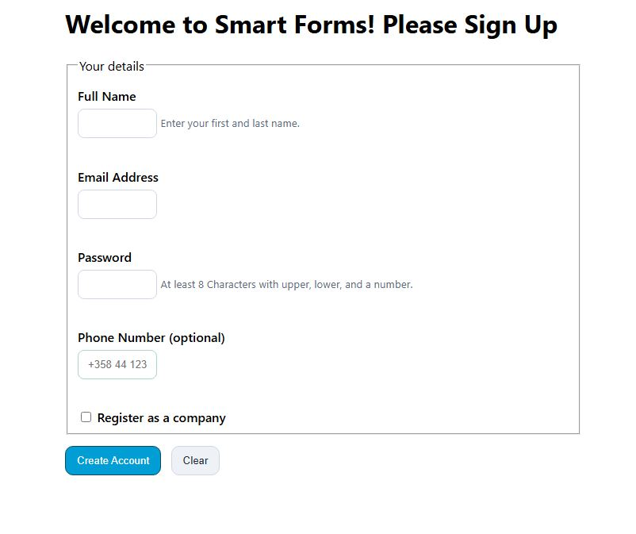

Landing Site, with company toggle active

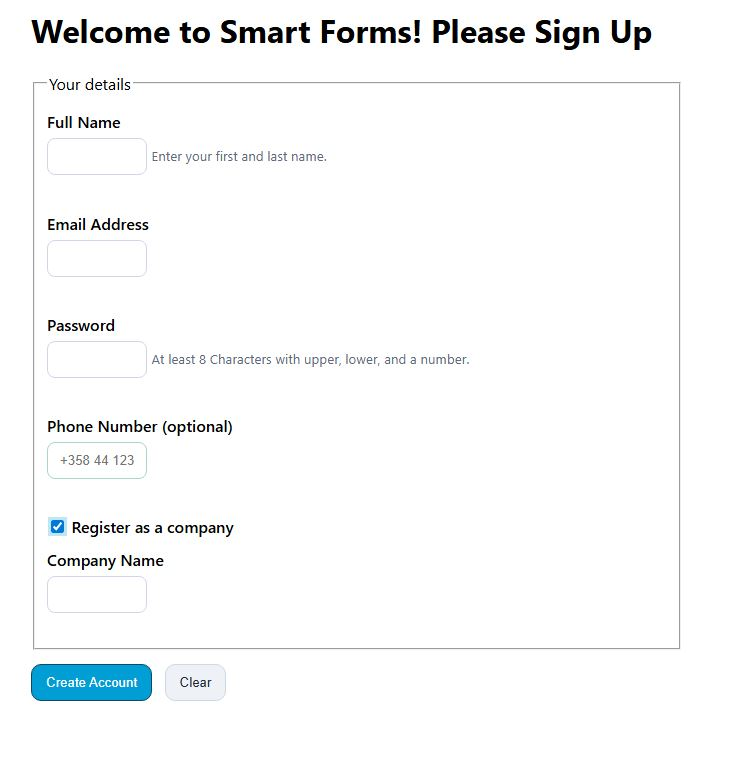

Validation and Errors

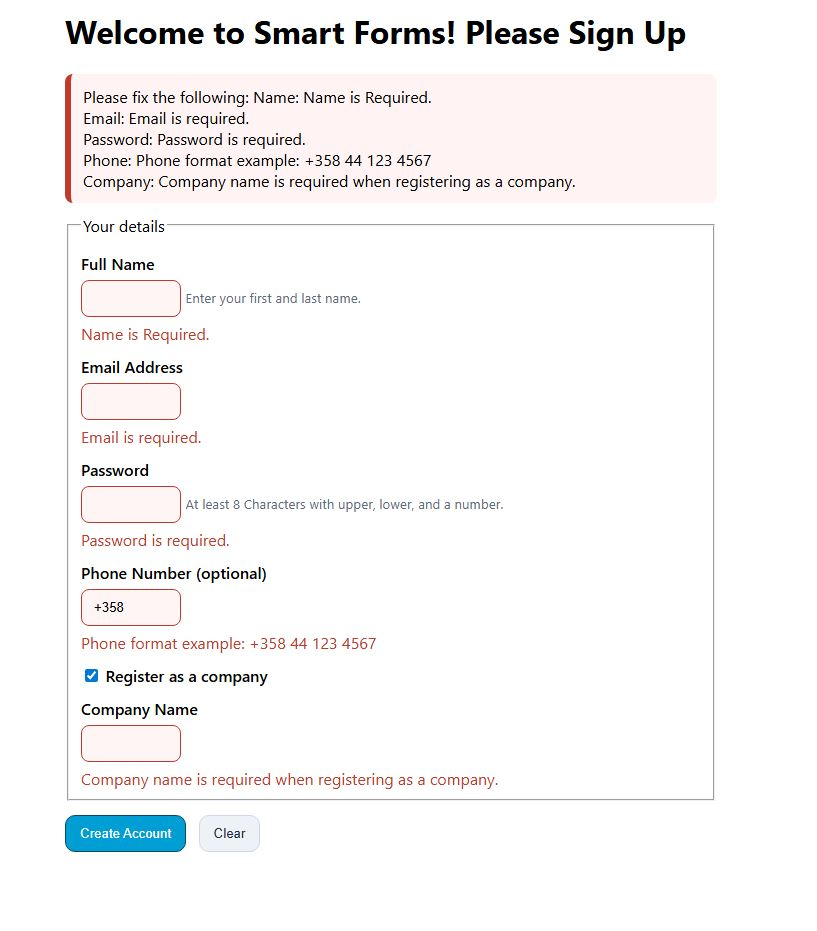

Saved Draft

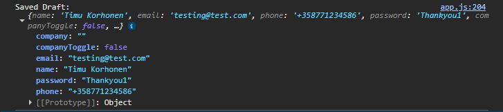

Submitted Data Success

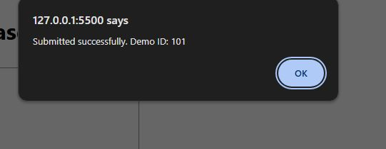

Submitted Data excluding Password

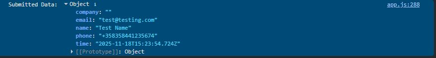

Saved even on Refresh Restored Data

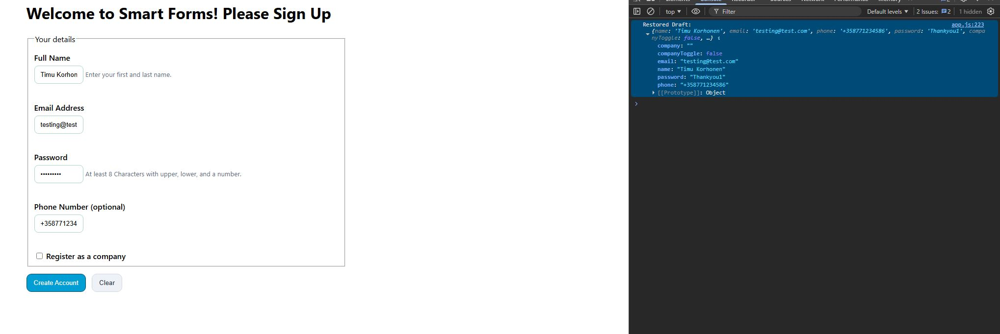

Created Breakpoint at saveDraft Function

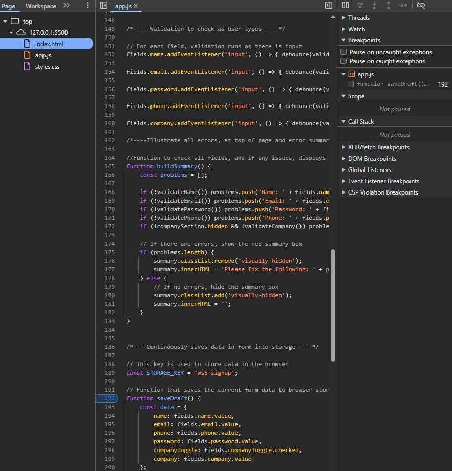

Pauses when entering field data, reaches the breakpoint

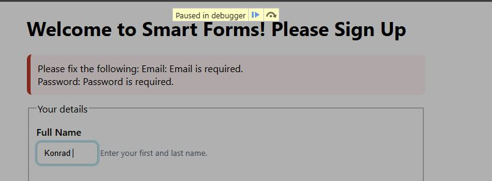

Using Step over and Step Into Showcasing Scope data

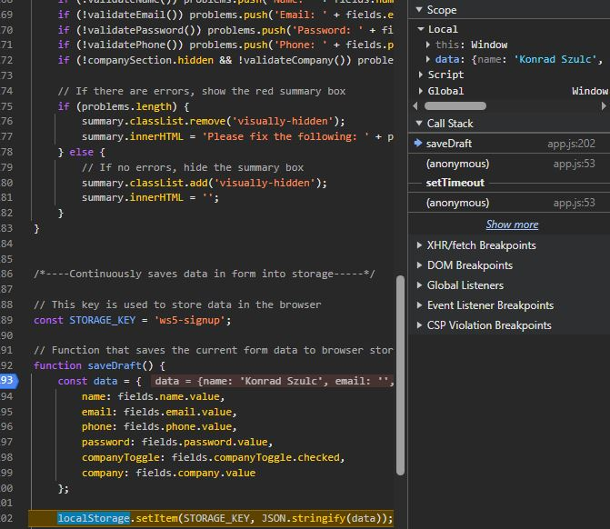

Screen Reader Usage

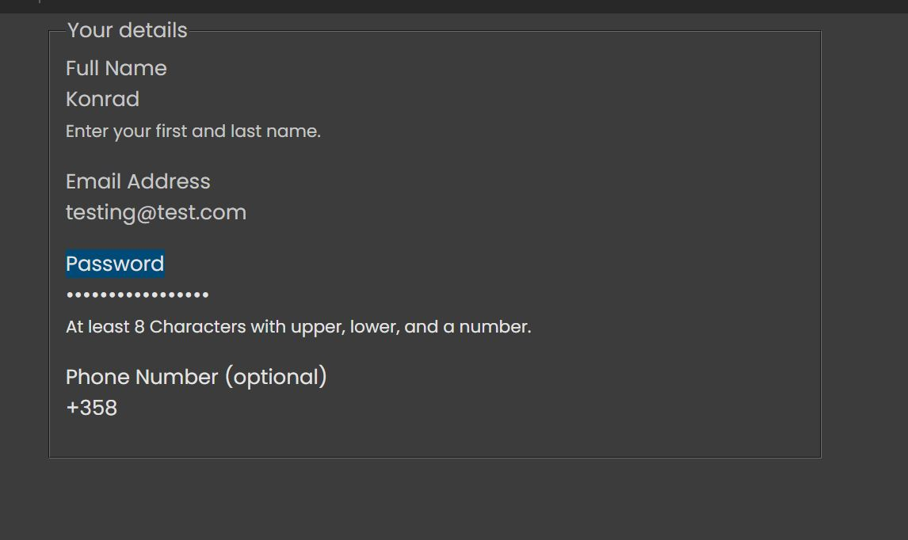